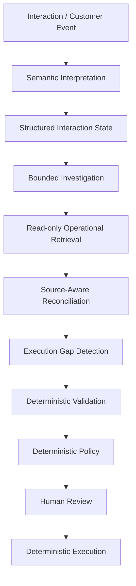

# Tubo

## Revenue Execution OS

Tubo reconciles what customers said with CRM, email, tasks and commercial state
before consequential revenue actions happen.

- [Live Application](https://web-production-a72e0.up.railway.app/)
- [Case Study](docs/case-study.md)
- [Directive](directive.md)
- [Architecture](docs/architecture.md)
- [Evaluation Package](docs/evaluation-package.md)
- [Runbook](docs/runbook.md)
- [AI Collaboration / How I Built It](docs/ai-collaboration.md)

---

## Evaluator Demo Account

Live application: https://web-production-a72e0.up.railway.app/

A preconfigured Tubo evaluator account is provided so the full workflow can be
reviewed immediately using synthetic test business data.

- **Tubo login:** `testuser@must.com`
- **Connected Google test account:** `musthirenoor@gmail.com`

Passwords are provided in the private submission instructions.

Google OAuth is currently running in assessment/test configuration. Only
explicitly allowlisted Google accounts can complete Google OAuth. Therefore the
evaluator account is already connected to the dedicated Google test account. If
an evaluator wants to connect another Gmail/Calendar account during the
assessment, they can contact Noor to have that account added to the OAuth
test-user list.

This restriction applies only to Google OAuth onboarding. The rest of Tubo can
still be explored through another Tubo account without requiring direct
assistance, subject to the integrations that user chooses to configure.

---

## The Problem

A customer conversation may say one thing while operational systems say another:

- HubSpot says something different.
- An old task is still open.
- An email was already sent.
- Commercial state changed.
- A commitment was never recorded.

This is **operational state drift**. After every conversation, reality fragments
across transcript, CRM, email, tasks, calendar and subscription state — and the
operator has to reconcile it by hand. Tubo exists to reconcile that state.

---

## What Tubo Does

1. Receive an interaction or customer event.
2. Understand commitments, decisions, questions and context.
3. Investigate relevant operational systems.
4. Reconcile evidence using source authority.
5. Detect execution gaps.
6. Validate policy and risk.
7. Request human review when needed.
8. Execute approved actions deterministically.
9. Record provenance and audit state.

---

## How the AI System Works

The LLM is given the authority to understand, retrieve, compare, investigate and
propose. It is denied the authority to execute, approve, or override policy.
Policy, approval and consequential execution are deliberately separated from
semantic reasoning.

### Semantic Interpretation

The `SemanticInterpreter` turns an untrusted interaction into a validated
`SemanticState`. The model distinguishes:

- **confirmed commitment** — explicit, unconditional obligation.
- **discussion** — suggestion/brainstorm, not a commitment.
- **conditional commitment** — "if X, then I'll Y", condition preserved verbatim.
- **decision** — "we've decided", "moving forward".
- **commercial fact/claim** — "signed / paid / activated" as a signal, not a conclusion.
- **ambiguity** — unresolvable owner/date left null, never invented.

Every claim is bound to an evidence span; the deterministic `enforceRules` safety
net downgrades anything the model mis-buckets.

### Bounded Investigation

The AI selectively retrieves relevant context through read-only tools. There is
no mutation tool for the agent to call. Actual tools include:

`resolve_account`, `get_account_context`, `get_contacts`, `get_open_deal`,
`get_recent_notes`, `get_open_tasks`, `get_email_thread`, `check_existing_action`,
`get_commercial_state`, `get_customer_activity`, `get_commercial_exception`.

Retrieval is bounded (a `DeterministicToolPlanner`), not retrieve-all: it always
fetches the authoritative deal + tasks, and fetches commercial/Gmail only on a
signal.

### Source-Aware Reconciliation

Different systems have different authority. `reconcile` compares each semantic
item against authoritative operational context and classifies it. A weaker
source can never overwrite a stronger one:

| Fact | Authoritative source | Evidence-only |
|---|---|---|
| Subscription / payment / commercial truth | commercial (HubSpot commercial context) | conversation intent |
| What the customer literally promised | conversation | CRM metadata |
| Whether an operational task exists | tasks / HubSpot | transcript inference |
| CRM stage / owner | HubSpot | conversation |
| Communication actually sent / delivered | Gmail | conversation |

### Execution Gap Detection

Reconciliation produces classified findings from the implemented state set:

- `MISSING` — confirmed commitment has no operational representation.
- `DUPLICATE` — an equivalent task already exists.
- `CONTRADICTORY` — claim conflicts with authoritative state.
- `STALE` — one source lags authoritative state.
- `AMBIGUOUS` — identity/owner/date cannot be resolved.
- `UNSAFE` — injection detected, or a required source is unavailable.
- `ALIGNED` — no gap.

### Deterministic Policy

Consequential actions are not delegated to the LLM. `evaluateAction` is the sole
execution gatekeeper: it blocks prompt-injection, policy-override attempts,
external sends, unsupported high-impact mutations, and anything outside the
allowlist. Closed Won requires authoritative active commercial state plus a deal
not already closed; Closed Lost requires trial ended + grace elapsed + no active
subscription + no exception. LLM/agent output has zero policy authority.

### Human-in-the-Loop

Consequential actions surface as proposals requiring approval (approve / edit /
reject, with per-action dependencies). **Missing Context Resolution** lets a
human answer a gap from candidates derived from real data; the answer is recorded
as human-supplied context with provenance, never rewritten as model-derived
evidence.

### Deterministic Execution

Only allowlisted actions execute, and only when approved:

- HubSpot **task** creation.
- HubSpot **state** update (field / deal stage).
- Gmail **Draft** creation.

Tubo does **not** automatically send email. `send` is always blocked; Gmail
actions are draft-only.

### Architecture



`packages/core` is the pure, deterministic, I/O-free correctness backbone
(semantic schema, reconciliation, policy, providers, idempotency). `apps/api`
composes it with the LLM interpreter and read-only integrations. `apps/web`
consumes the API.

---

## Integrations

### HubSpot

CRM/deal/contact/task state and configured commercial context (native Commerce
subscriptions, or an explicit CRM property mapping such as
`revexec_billing_status`). Deal stage is never commercial truth.

### Gmail

Relevant communication evidence (what was actually sent/replied) and approved
Gmail Draft creation. No automatic send.

### Google Calendar

Meeting context and correlation (event id → meeting URL → organizer/time/
participant overlap → HubSpot account).

### Fireflies

Tubo does **not** control whether Fireflies joins a meeting. A persistent
background worker checks eligible meeting context and synchronizes
transcripts/notes that Fireflies has already produced. This allows Tubo to ingest
meeting notes, identify participants, and connect meeting context to relevant
HubSpot accounts without manual copy/paste. Manual Process Interaction remains
available for pasted notes/transcripts.

### Background Worker

A durable Postgres-backed job queue (no Redis) drives periodic integration
synchronization (`calendar.sync`, `fireflies.sync`, `fireflies.fetch`), tracked-
account refresh (`account.refresh`), and `interaction.process`. Transient
failures retry with bounded backoff; permanent failures persist as `failed`.

---

## Evaluation

Extracted from the committed artifacts (`evals/predeploy-v4-summary.md`,
`evals/system-v0-summary.md`, `evals/os-v0-summary.md`,
`docs/intelligence-quality-v4.md`, `docs/architecture-comparison-final.md`).

| Category | Result |
|---|---|
| Official frozen evaluation (14 use cases) | **12/14** |
| Stability (3× runs) | **12/14 × 3, no flips** |
| Supplemental / lifecycle evaluation (8 cases) | **8/8** |
| Retrieval quality (required-context recall) | **0.972** (target ≥ 0.90) |
| Classification accuracy | **1.0** |
| Owner accuracy | **1.0** |
| Safety — external executions / bypass / injection escalation | **0 / 0 / 0** |
| Architecture comparison — bounded vs retrieve-all | bounded **12/14**, 4 unnecessary calls, avg 3.75 calls/run (vs 10 / 8.0 retrieve-all) |

Selected model: **gpt-6-astra** (Responses API, effort `medium`).

User/workflow outcome reflects Luis's real post-meeting workflow, collected
organically. Measured user evidence is the pilot feedback (two verbatim quotes
from Luis Mussa, CSM).

See the full evaluation in the [Evaluation](/evaluation) page and
`docs/intelligence-quality-v4.md`.

### Failure-Driven Development

- A keyword/regex evaluator that did not exercise the production semantic model
  (3/14) was rejected as an invalid measure and replaced with the real-model
  harness (`docs/evaluation-harness-audit.md`).
- `gpt-5.6-sol`/`gpt-5.6-terra` were investigated and found unavailable on the
  configured account; the benchmark pivoted to `gpt-6-astra`.
- Frozen ground truth was preserved, not rewritten to make tests pass (two cases
  flagged `GROUND_TRUTH_QUESTION`).
- Retrieval recall moved 0.792 → 0.972 by making the planner bounded rather than
  retrieve-all.

---

## Reliability

Confirmed by the repository: Zod request validation, persistence-backed
idempotency, durable job persistence, bounded retries (transient-only), timeouts,
fail-closed behavior (missing source → `missing context`, never a guess),
append-only audit trail, structured provider errors, `/health` and `/ready`
endpoints, human approval gating, and per-user tenant isolation.

---

## Quick Start

```bash
# 1. Install workspace dependencies
npm install

# 2. Configure environment (copy and fill in the real values)
cp .env.example .env
#   - DATABASE_URL (Postgres)
#   - LLM key (OpenAI-compatible; gpt-6-astra is the evaluated model)
#   - GMAIL_CLIENT_ID / GMAIL_CLIENT_SECRET (OAuth)
#   - HUBSPOT_ACCESS_TOKEN

# 3. Run API, worker, and web (three terminals)
npm run dev --workspace @revexec/api
npm run worker
npm run dev
```

Environment variables are documented in `.env.example`; no secrets are
committed.

---

## Project Structure

```
tubo/
├── directive.md          # locked product definition
├── README.md
├── nixpacks.toml         # Railway build config
├── package.json          # npm workspaces root
├── tsconfig.base.json
├── .env.example
├── packages/core/        # pure deterministic: semantic, reconciliation, policy, providers
├── apps/api/             # Hono API + worker + repositories + integrations
├── apps/web/             # Vite + React SPA
├── evals/                # frozen cases/expected + results
├── docs/                 # architecture, reliability, integration docs
├── db/migrations/        # SQL migrations
└── research/             # manual baseline method
```

---

## Documentation

- [`directive.md`](directive.md) — product definition.
- [`docs/architecture.md`](docs/architecture.md) — AI architecture and authority model.
- [`docs/evaluation-package.md`](docs/evaluation-package.md) — full evaluation.
- [`docs/runbook.md`](docs/runbook.md) — non-developer operator runbook.
- [`docs/case-study.md`](docs/case-study.md) — portfolio case study.
- [`docs/ai-collaboration.md`](docs/ai-collaboration.md) — AI collaboration note.

---

## Limitations

- Google OAuth runs in assessment/test configuration with an explicit allowlist
  of test accounts.
- Five-day scope: single-user tenancy (no enterprise multi-user RBAC); email is
  draft-only (no automatic send).
- Commercial truth depends on the connected HubSpot commercial context (native
  Commerce subscriptions or an explicitly configured property mapping).
- Fireflies ingestion depends on transcripts Fireflies has already produced.

---

## Two-Week Plan

A short summary: close the trust loop (reviewed external send, distributed rate
limiting, real-data E2E verification) in week one; operationalize (batch account
scan, webhook-driven re-reconcile, quantified operator time-to-review) in week
two. See the [Case Study](/case-study) for the full plan.
