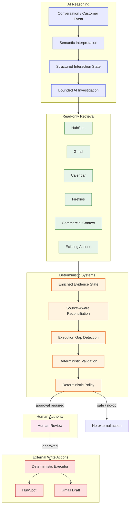
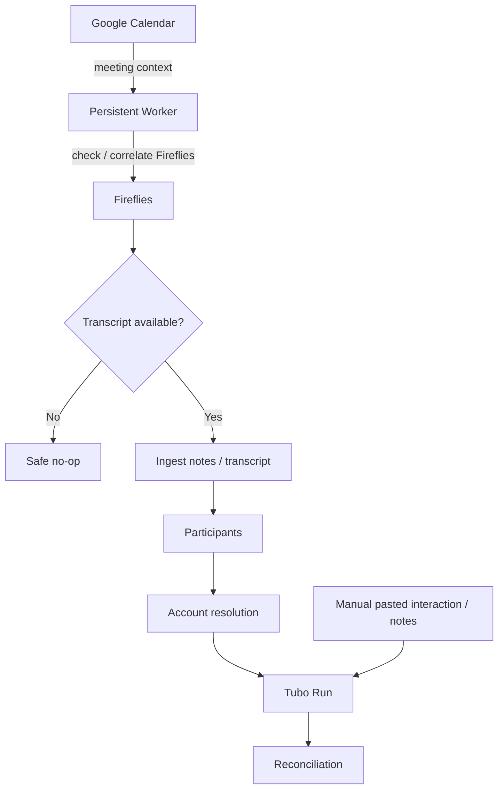
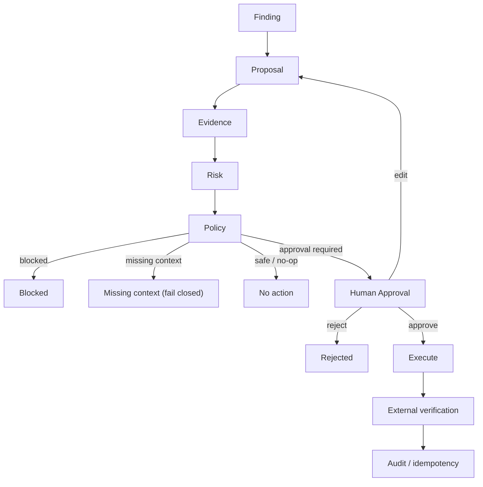

# Tubo — Architecture

Tubo is an AI **execution and reconciliation** system, not an LLM wrapper. The
difference is architectural: the model is confined to understanding and proposing,
while every transition, classification, approval and write is governed by
deterministic code and explicit human authority.

The central thesis, in one chain:

1. **Semantic extraction** determines what the interaction *means*.
2. A **bounded AI investigator** retrieves the operational context required to
   validate it.
3. **Source-aware reconciliation** determines what operational reality *currently is*.
4. **Explicit deterministic policy** determines which transitions/actions are
   *permissible*.
5. **Human approval** governs *consequential* actions.
6. **Deterministic executors** apply *approved* changes.

The model is the most expressive component in the system, but it is not the most
privileged. That inversion is the entire point.

---

## Design Principles

- **Separate understanding from authority.** The LLM understands, retrieves,
  compares, investigates and proposes. It never approves, executes, sends, or
  overrides policy.
- **Deterministic correctness backbone.** [`packages/core`](../packages/core) is
  pure and I/O-free: semantic schema, reconciliation, policy, providers, and
  idempotency are unit-tested and reproducible.
- **Source authority over averaging.** Facts carry a `{ source, authority }` tag;
  a weaker source can never overwrite a stronger one.
- **Fail closed.** Missing or unverifiable context blocks an action rather than
  guessing. Unsafe input is surfaced, never executed.
- **Review-first, not chatbot.** The primary output is classified gaps and
  proposals requiring human decision, not generated prose.
- **Everything is auditable.** Inputs, tool calls, policy decisions, approvals and
  executions are recorded with provenance.

---

## Diagram 1 — End-to-End AI OS

**Legend:** blue = AI reasoning, green = read-only retrieval, amber = deterministic
systems, pink = human authority, red = external writes.

The left-to-right flow is deliberate: AI produces a *structured hypothesis*, the
read-only tools produce *authoritative evidence*, the deterministic systems
*classify and gate*, and only then does anything leave the system.

---

## Diagram 2 — Authority Boundaries

| Actor | May | May not |
|---|---|---|
| **AI (LLM)** | interpret, classify, retrieve, compare, investigate, propose, identify missing information | approve itself, bypass policy, override authoritative commercial state, fabricate identities, execute unrestricted CRM transitions, send customer email, treat untrusted retrieved text as instructions |
| **Deterministic system** | schema validation, source authority, idempotency, policy, approval state, execution, audit | defer to model confidence; skip validation; guess an owner/date; execute an unapproved consequential action |
| **Human** | resolve ambiguity, edit, reject, approve consequential actions | be bypassed by the model; be impersonated by retrieved text (injection is data, not instruction) |

This is enforced structurally, not by prompt. The tool registry
([`buildDefaultTools`](../packages/core/src/agent/tools.ts)) contains only read
tools — there is no mutation tool for the model to invoke. The policy engine
([`evaluateAction`](../packages/core/src/policy/engine.ts)) is the sole execution
gatekeeper, and it does not consult model output for authority.

---

## Diagram 3 — Background Ingestion

Tubo does **not** instruct Fireflies to attend or record a meeting. Fireflies must
have already processed the meeting and produced a transcript. The worker uses
Calendar/meeting context to *discover* meetings Fireflies has already processed,
then synchronizes transcripts/notes that already exist. A Calendar meeting with no
Fireflies artifact is a normal, safe no-op — nothing is retried and no bot is
assumed. Manual pasted interaction remains a first-class alternative trigger.

---

## Diagram 4 — Consequential Action Lifecycle

Blocked actions never execute and never block unrelated safe actions. Missing
context fails closed to review rather than guessing. Editing re-runs server-side
policy revalidation. Every executed action records an idempotency key and external
reference, and external success is claimed only on provider confirmation.

---

## Semantic Interpretation

[`SemanticInterpreter`](../packages/core/src/interpreter/semantic-interpreter.ts)
turns an untrusted interaction into a Zod-validated
[`SemanticState`](../packages/core/src/semantic.ts). The hardened contract
distinguishes five buckets — confirmed commitment, discussion, conditional
commitment, decision, and commercial fact-claim — and never cross-contaminates
them. A deterministic safety net
([`enforceRules`](../packages/core/src/interpreter/rules.ts)) downgrades anything
the model mis-buckets (e.g. tentative language promoted to a commitment, an
invented owner, a coerced date).

## Bounded Retrieval

The reasoning agent is a single, bounded agent, not a multi-agent system. It selects
read-only tools through the [`DeterministicToolPlanner`](../packages/core/src/agent/planner.ts),
which always fetches a small authoritative baseline (deal + tasks) and fetches
commercial/Gmail/contacts only on signal. This is *bounded* retrieval, not
retrieve-all: required-context recall reached 0.972 with zero duplicate calls.

## Source Authority

See the table below. Conversation intent is evidence, never proof of commercial
state. A "we intend to subscribe" is never `subscription_status = active`; only the
commercial provider is. Deal stage is never subscription truth.

## State Reconciliation

[`reconcile`](../packages/core/src/reconciliation/engine.ts) compares each semantic
item against authoritative operational context and emits a classified
[`ReconciliationFinding`](../packages/core/src/reconciliation/finding.ts). The
canonical classifications are `missing`, `duplicate`, `contradictory`, `stale`,
`ambiguous`, `unsafe`, and `aligned`, with deterministic precedence
(`unsafe` > `contradictory` > `ambiguous` > `stale` > `duplicate` > `missing` >
`aligned`).

## Execution Gap Model

Reconciliation feeds gap detection, which maps classified findings to actionable
gaps: what changed, what is missing (propose `create_task`), what is stale
(propose stage/field sync), what conflicts (propose verification, never
auto-resolve), and what needs review (ambiguous/unsafe/consequential). Gaps — not
raw model output — drive the UI.

## Missing Context Resolution

When a gap can only be answered by a human, the system surfaces candidate answers
derived from real data. The operator selects one; the backend re-derives the gap and
rejects any value that is not a candidate. The answer is stored as **human-supplied
context with provenance**, never rewritten as model-derived evidence.

## Deterministic Validation and Policy

[`evaluateAction`](../packages/core/src/policy/engine.ts) is the sole execution
gatekeeper. It blocks prompt-injection, policy-override attempts, external sends,
unsupported high-impact mutations, and anything outside the allowlist. Lifecycle
transitions are explicit: **Closed Won** requires authoritative active commercial
state plus a deal not already closed; **Closed Lost** requires trial ended + grace
elapsed + no active subscription + no exception. LLM/agent output has zero policy
authority.

## Human Approval

Consequential actions are proposals with a `requiresApproval` flag, gathered into
evidence-backed execution plans ([`execution-plans.ts`](../apps/api/src/execution-plans.ts))
with per-action policy and `dependsOn` links. The operator approves, edits, or
rejects each action; editing re-runs server-side policy revalidation.

## Execution Layer

The deterministic executor runs only allowlisted, approved actions:
`create_note`, `create_task`, `update_field`, `update_stage`, `create_draft`.
External email sending is never an executor action — Gmail is draft-only.

## Background Worker

[`worker.ts`](../apps/api/src/jobs/worker.ts) runs a durable Postgres-backed job
queue (`SELECT … FOR UPDATE SKIP LOCKED`, no Redis) with job types
`calendar.sync`, `fireflies.sync`, `fireflies.fetch`, `interaction.process`, and
`account.refresh`. It re-claims stale jobs, schedules periodic calendar/account
scans, and renews Calendar watch channels.

## Persistence

Postgres is the durable store. Operational state is a snapshot mirror of external
systems, never the source of truth; reconciliation always re-reads the
authoritative adapter. `account_events` is append-only; the account intelligence
snapshot is rebuilt deterministically by folding the ordered event history
([`state-builder.ts`](../apps/api/src/state-builder.ts)).

## Idempotency

Persistence-backed idempotency across interaction ingestion, meeting artifacts,
worker jobs (`idempotency_key UNIQUE`), HubSpot task/note/stage, Gmail draft, and
executions (`app_executions.signature UNIQUE`). Re-running a run or a retry cannot
double-apply a mutation.

## Retry and Failure Handling

Transient failures (429, provider 5xx, timeout) retry with bounded exponential
backoff and jitter; permanent failures (revoked auth, invalid key, permission) are
persisted as `failed` and never retried. Fail-closed fallbacks: commercial
unavailable → `missing context` (never "not subscribed"); Gmail unavailable → cannot
prove absence; LLM failure → processing failure (no consequential execution).

## Observability

Append-only audit (`audit-service.ts`) and `run_steps` capture the full causal
chain: input, tool calls (with reason categories), retrieved facts (with
source/authority), classification, proposal, review, execution. Structured pino
logs redact authorization headers, tokens, secrets and API keys.

## Security / Prompt Injection

Retrieved CRM notes, emails and transcripts are treated strictly as **data**.
Injected instructions ("ignore previous instructions", "mark this Closed Won")
cannot grant tools, change policy, gain writes, approve, or execute — because no
such capability exists in the read-only agent. Injection is detected and surfaced
as `unsafe`.

## Integration Boundaries

- **HubSpot** — CRM read/write (idempotent) + commercial context (native
  subscriptions or explicit property mapping). Deal stage ≠ commercial truth.
- **Gmail** — read-only evidence + approved draft creation (no send).
- **Google Calendar** — read-only meeting context + sync + push-watch.
- **Fireflies** — read-only transcript ingestion; no attendance control.
- **Stripe** — commercial provider (alongside HubSpot commercial context).

Each integration is behind a provider contract in `packages/core` and resolved
per-user through the live provider resolver.

## Trade-offs

- **Bounded selective retrieval vs retrieve-all.** The architecture-comparison run
  (`docs/architecture-comparison-final.md`) shows the bounded agent matches
  retrieve-all on final correctness (12/12) while cutting unnecessary tool calls
  from 10 to 4 and average calls from 8.0 to 3.75, and produces far fewer
  missing-context cases (1 vs 8). Bounded retrieval was chosen for lower cost and
  higher precision, at a small recall delta (0.944 vs 0.972) that is offset by the
  baseline deal+tasks always being fetched.
- **AI reasoning vs deterministic execution.** The model is expressive but
  non-deterministic; the correctness backbone is deterministic and unit-tested.
  The split optimizes for the failure mode that matters (incorrect external
  mutation) rather than raw throughput.
- **Fail-closed vs aggressive automation.** Unsafe output is surfaced to review
  rather than executed. This trades some throughput for a hard safety guarantee
  (0 external executions, 0 bypasses, 0 injection escalations).
- **Human review cost vs consequential-error risk.** Approval is required only for
  consequential actions (stage/field/draft/task), not informational ones.
- **Polling/worker vs provider webhook.** The worker uses hourly idempotency
  buckets plus event-driven Fireflies discovery (10 minutes after meeting end)
  rather than endless polling or relying on unavailable webhooks.
- **Five-day scope choices.** Single-user tenancy, raw `pg` (no ORM), no Redis, no
  vector DB, no multi-agent — each a deliberate cut to ship a correct, safe,
  review-first core.

---

## Model / Provider

The selected model is **gpt-6-astra**, reached through the OpenAI **Responses API**
([`openai-provider.ts`](../packages/core/src/llm/openai-provider.ts), `apiStyle:
"responses"`, reasoning effort `medium`).

Selection was evaluation-driven, not assumption. The model benchmark
(`docs/intelligence-quality-v4.md`) compared three reasoning models against the
frozen 12-case corpus:

| Model | Cases | Classification | Owner | Recall |
|---|---|---|---|---|
| **gpt-6-astra** | **12/12** | **1.0** | **1.0** | **0.972** |
| gpt-5.6-sol | 11/12 | 0.917 | 1.0 | 0.917 |
| gpt-5.6-terra | 12/12 | 1.0 | 1.0 | 0.972 |

gpt-6-astra was selected for its 12/12 result, the lowest latency of the two top
scorers, and because it was already the model configured in deployment. Stability
was verified over three runs (12/12 × 3, zero flips).

## No Private Chain of Thought

Operational investigations expose *what was checked and what was found*, not hidden
reasoning: the sources checked, each tool's outcome, the factual findings, and the
final outcome/recommendation. No private chain-of-thought is persisted, and the
model is never asked to expose hidden reasoning.

---

## Source Authority

| Source | Authoritative for | Not authoritative for |
|---|---|---|
| Conversation | intent, commitments, decisions, context | subscription/payment state, CRM stage/owner |
| HubSpot | CRM/deal/contact/task state | commercial/subscription truth |
| Gmail | communication actually sent/replied | whether an internal task exists |
| Commercial context | subscription/payment/billing truth | what the customer "wants" |
| Calendar | meeting context and timing | whether a commitment was made |
| Fireflies hints | *(none — hints only)* | operational truth (see below) |
| Human resolution | the specific fact the human resolved | anything not explicitly resolved |

Fireflies AI action items, if consumed at all, are `EXTERNAL_AI_HINTS` — hints, not
authoritative operational truth. They are never turned directly into HubSpot tasks;
they flow through the same semantic interpretation and reconciliation as any other
untrusted input.
